# User Interface
This document explains how to run the app on a dev server locally for testing with a UI. Follow these steps to test the UI:

- [1. Ensure Backend is Running](#1-ensure-backend-is-running)
- [2. Configure Frontend](#2-configure-frontend)
- [3. Run Application](#3-run-application)
- [4. User Interface Overview](#4-user-interface-overview)
- [5. Doing Some UI Tests](#5-doing-some-ui-tests)
  - [Create Bounty](#create-bounty)
  - [Create Proposal](#create-proposal)
  - [Approve Proposal](#approve-proposal)
  - [Withdraw Funds](#withdraw-funds)

# 1. Ensure Backend is Running
Ensure you have followed [steps 1..5 in the section **How to Compile, Migrate and Test Contracts** of the README.md](../README.md#how-to-compile-migrate-and-test-contracts) document. This ensures the backend is all setup correctly.

# 2. Configure Frontend
Ensure your browser is listening for your ganache-cli blockchain you started earlier on port 8545. For example, if you are using MetaMask you can select this:

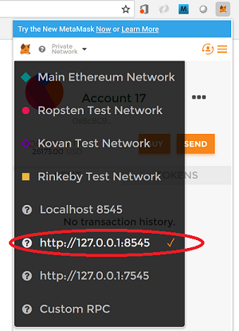

To give yourself some Ether, you can pick an account shown at the top of your `ganache-cli` window and import that into MetaMask. For example when you run ganache-cli you will see output like this:

```
> ganache-cli
Ganache CLI v6.1.3 (ganache-core: 2.1.2)

Available Accounts
==================
(0) 0x29a94a37303ef5308d99c4f128c388c5f2427e6e
(1) 0x8ede71a3f678e0806390129bbab9d6edf47c2800
...etc...

Private Keys
==================
(0) 6069cfbb37964abe69f853b84f4491e488d88eff6bc5bbe01e188f3187039ee5
(1) e3a38205715e8e2bd3756ceaf11ade5fe7b1ff11b88903132950e3035e1f9321
...etc..
```
Pick one of the private keys and copy it. Then import the account using the private key:

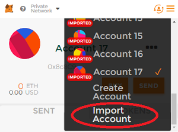

On the next screen paste in the private key.

The account you use should have some Ether so you can make transactions:

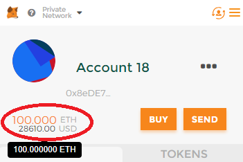

An alternative way is to import all the test accounts from ganache-cli into MetaMask using the passphrase shown when ganache-cli starts up. This was outlined in the course.

# 3. Run Application
Your browser should now be listening for a blockchain on port 8545 and your injected Web3 instance (e.g. MetaMask) should have a valid account with some Ether.

You are now ready to run the app!

The UI is heavily based on the Pet Shop Tutorial UI and uses the same lite-server to host the page. I am not a JavaScript or Web UI developer, as you will see.

In a shell or command prompt in the root of the Truffle project (the folder with the `truffle.js` file) run this:

```
> npm run dev
```
You should see an output similar to the below and a web page should open in your browser with URL `http://localhost:3000/` or similar.
```
> lite-server

** browser-sync config **
{ injectChanges: false,
  files: [ './**/*.{html,htm,css,js}' ],
  watchOptions: { ignored: 'node_modules' },
  server:
   { baseDir: [ './src', './build/contracts' ],
     middleware: [ [Function], [Function] ] } }
[Browsersync] Access URLs:
 -------------------------------------
       Local: http://localhost:3000
    External: http://192.168.0.11:3000
 -------------------------------------
          UI: http://localhost:3001
 UI External: http://192.168.0.11:3001
 -------------------------------------
[Browsersync] Serving files from: ./src
[Browsersync] Serving files from: ./build/contracts
[Browsersync] Watching files...
```
The web page that opens is the app. Usage is explained in the next section.

# 4. User Interface Overview
**Goals**:
* You should be able to visit a URL and interact with the application.
* App recognizes current account.

The top part of the UI looks like this:

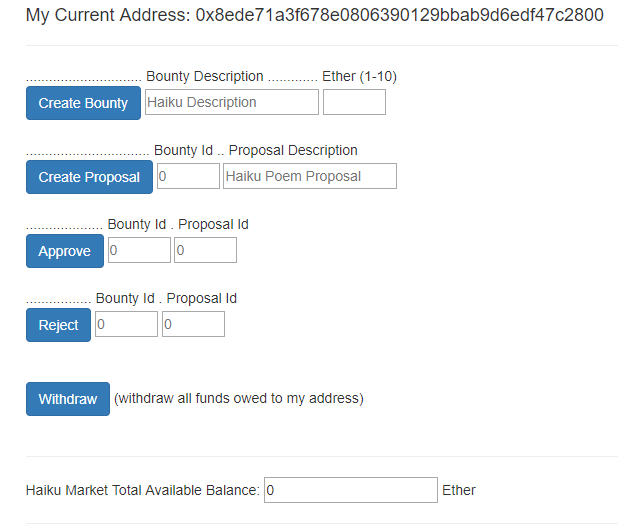

Your current address is shown at the top.

The series of blue buttons allows you create a bounty, create a proposal for a bounty, approve a proposal for a bounty, reject a proposal for a bounty and finally to withdraw any funds due.

Below the blue buttons is a figure showing how much Ether is available across all bounties in the market. When first starting this will be zero.

The bottom part of the UI looks like this:

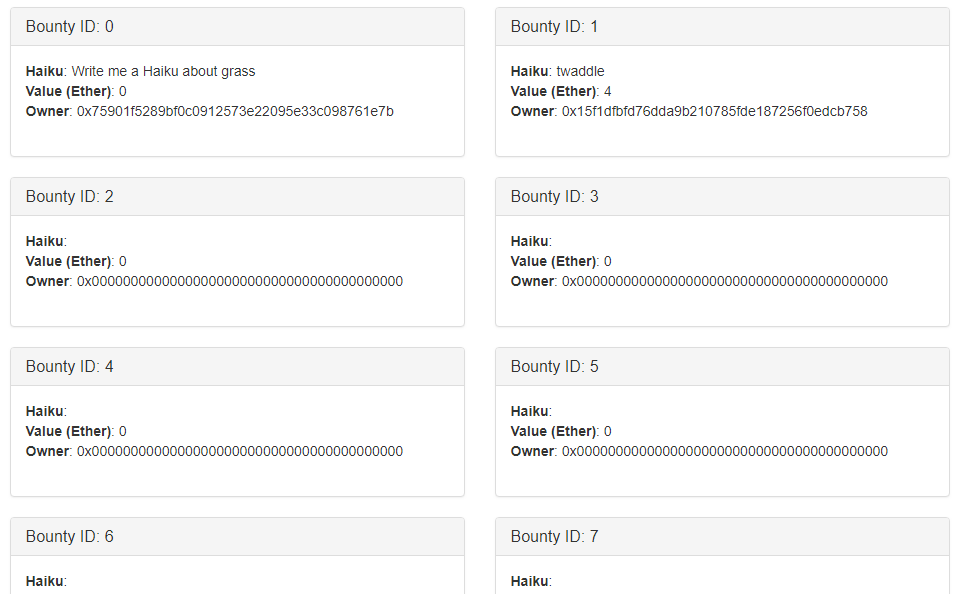

This shows a responsive grid of the available bounties. The bounty with ID 0 (worth 0 Ether) is some test data. Those with an Owner = 0x (the zero address) are not yet filled, but will get filled as bounties are added. Proposals can be interacted with using the blue buttons, however proposals are not visible on the UI. My web UI development skills are not sufficient to allow me to significantly improve on this layout in the time available.

# 5. Doing Some UI Tests
**Goals**:
* Sign transactions using MetaMask.
* Contract state is updated.
* Update reflected in UI.

Let's walk through a bounty lifecycle and see how the UI works. You will create a bounty, a proposal, then approve the proposal and withdraw funds. For simplicity, in this example we will use the same account for all steps, but you could switch between accounts for "job poster" and "job hunter" to make it more realistic. 

**Important Notes**:
* In tests, most transactions succeed with default gas limits suggested by MetaMask. For safety if you make the default gas 300000 then everything will be fine. 
* In most cases, the UI refreshes itself. In some cases you have to manually refresh the page. If a UI change does not appear, always refresh the pages first.

## Create Bounty
Imagine you are about to go on a seaside holiday, and really want a Haiku to enjoy whilst on your journey. Let's use our dApp to request a Haiku about the sea. Create a new bounty for this as shown:

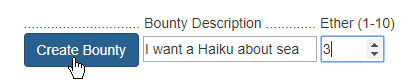

MetaMask (or whatever equivalent you are using) will then ask you to sign the transaction, notice the 3 Ether you promised as a bounty reward is being sent:

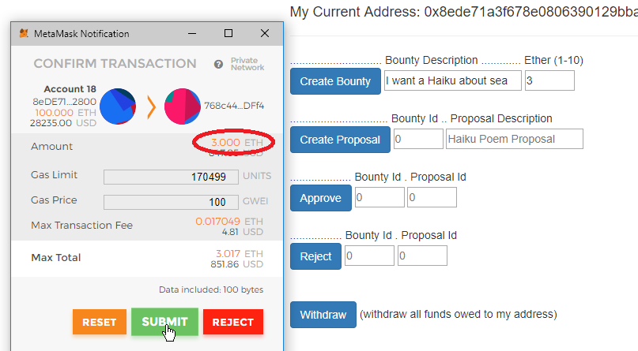

A few seconds later you should see the transaction being confirmed:

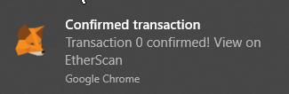

At this point you may need to refresh the page to see the updates.

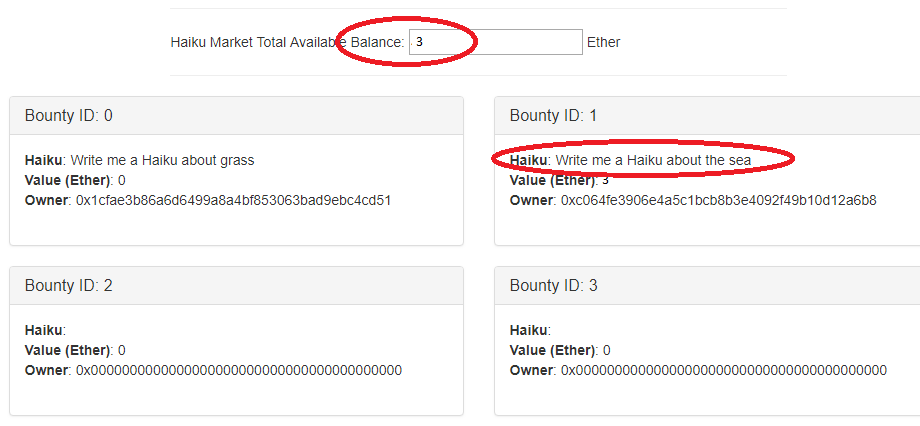

You can see the available market balance is 3 Ether and Bounty ID 1 now shows the "I want a Haiku about sea" request. The UI updates to reflect the contract state.

## Create Proposal
Now let's create a proposal for that bounty. We come up with this Haiku:

> As invading waves / retreat from the sandy shores / treasures are revealed.

We know our bounty ID is 1, and so can create a proposal like this:

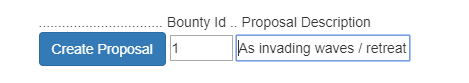

The transaction signing happens as before. The UI doesn't show the proposal ID created, but it is zero in this case because it's the first proposal for the bounty with ID 1.

## Approve Proposal 

We're delighted with this Haiku and want to approve it. We need to approve bounty ID 1 and proposal ID 0:

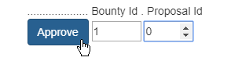

## Withdraw Funds

Now we can withdraw funds. We can note the account balance before and after we press withdraw:

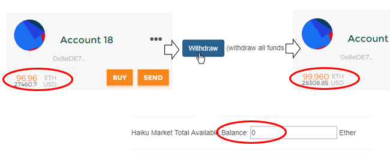

Our account's funds have increased, and the UI updates to show that the total market balance is back down at zero.